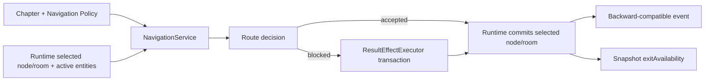

# NavigationService 合同

任务：`ARCH-001 / Slice 3`

合同版本：`idlewuxia.navigation_service.v1`

## 1. 目标与边界

`NavigationService` 是无状态的章节导航解释器。它负责把节点定义、房间连接、房间进入条件、NPC 阻断分支和项目导航桥策略解释为可测试的导航决策。

它不拥有：

- 玩家、章节、实体或任务 Runtime 状态；
- 事件写入、存档、DOM、CSS 或浏览器生命周期；
- 具体章节、房间、NPC、条件 Token 或 Result ID；
- 奖励、进度或 Result Effect 的提交权限。

`createFirstSessionRuntime` 继续是本切片的唯一状态权威。只有 Runtime 在收到通过的决策后才能修改当前节点/房间；阻断分支的效果仍交给事务型 `ResultEffectExecutor`。

所有公开决策都会深拷贝节点、房间、门槛、奖励、NPC 和分支定义；调用方修改返回对象不会回写配置权威。

## 2. 配置权威

导航语义由 `chapterSystem.navigationPolicy` 声明，并由 `config/wuxia_navigation_policy.schema.json` 使用 Ajv Draft 2020-12 实际校验：

| 配置字段 | 责任 |
|---|---|
| `roomEntryCondition.actionName` | 识别“玩家准备进入目标房间”的 Condition 定义 |
| `roomEntryCondition.targetRoomField` | 从 Condition 定义读取目标房间 ID |
| `blockerResult.actionName` | 识别阻断移动的 Result 动作 |
| `projectBridge.mode` | 决定是否允许玩家界面的配置化房间选择桥 |
| `projectBridge.mutationPolicy` | 强制项目桥只做导航，不拥有奖励或进度 mutation |
| `failurePolicy` | 未知定义或未配置路线失败关闭 |

具体房间和连接仍来自 `chapter1.rooms[]`；具体进入条件来自 `chapter1.conditionLookup`；具体阻断分支来自当前房间活动 NPC 的配置分支。程序不再通过房间 ID 正则生成 Token，也不再用固定 Result ID 判断阻断。

## 3. 公共接口

### `inspectNode(nodeId)`

输入节点 ID，返回节点定义及解析后的房间、门槛、奖励引用。未知节点拒绝；缺失的引用以 `{ missing: true }` 显式保留，供验证和 UI 诊断，不静默丢弃。

### `inspectRoomSelection(context)`

输入：

- `currentNodeId`；
- `currentRoomId`；
- `targetRoomId`；
- 当前房间经实体生命周期解析后的 `roomEntityIds`。

输出包含：

- `accepted/reason`；
- `routeKind`；
- 目标房间定义；
- 可选 `blocker`；
- 项目桥是否满足 `navigationOnly`。

`routeKind` 为 `initial_room_selection`、`current_room_selection`、`connected_exit`、`node_room_browser` 或 `project_navigation_bridge`。这让原有项目导航桥从隐式放行变为可观察、可验证的显式决策。

### `exitAvailability(context)`

只计算当前房间配置出口的可用性、阻断者、反馈、条件和证据。它不修改 Runtime，也不执行阻断 Result。

## 4. 运行链路

## 5. 原子性与失败规则

- 未知节点、未知房间、缺失策略或不允许的路线失败关闭；
- Schema 版本、`mutationPolicy` 或 `failurePolicy` 任一缺失/不支持时，服务自身也失败关闭，不依赖构建期 Ajv 才保证安全；
- 导航服务不 mutation，因此拒绝天然为零状态变化；
- 阻断效果事务失败时，Runtime 仍返回 `roomBlockEffectRejected`，目标房间不变且 `sideEffects=[]`；
- 普通阻断仍返回 `roomBlocked`，保留反馈、条件、结果和证据；
- 成功移动仍返回 `roomSelected`，原字段保持兼容，只增加 `routeKind/navigationOnly` 可观察字段；
- 存档 DTO 字段和版本不变。

## 6. 验证

`tools/test-navigation-service.mjs` 覆盖：

- 节点引用展开与缺失引用显式化；
- 未知节点/房间失败关闭；
- 由配置动作和目标字段解析房间进入条件；
- 由配置 Result 动作识别阻断，不依赖 Token/Result ID 命名；
- 连接出口、节点房间浏览和项目导航桥分类；
- 出口可用性与阻断反馈；
- 通用模块禁止出现具体章节/动作 ID 和旧的固定 Token 推导；
- 公开返回对象不可修改源 Definition，缺少 Schema/version/mutation/failure policy 的负例必须失败关闭；
- 真实 FB01 阻断链与 Runtime facade 兼容。

完整验收还必须执行 Runtime integrity、首局 54 事件交互、存档、Schema、Web/Android 发布闭包和真实浏览器手动视觉检查。

## 7. 已知限制与后续

- 项目导航桥继续按现有产品策略允许配置化房间选择；本切片只把它显式分类并禁止其拥有奖励/进度 mutation，没有改变玩家可见路线；
- 本 Slice 3 历史切片结束时，Entity 生命周期仍由 Runtime 闭包提供活动实体列表；`EntityInteractionService` 已在随后 Slice 4 提取；
- 本 Slice 3 历史切片结束时 `ChapterSession` 和 UI intent adapter 尚未提取；两者已在随后 Slice 5/6 完成，当前 `ARCH-001` 已关闭；
- `COMBAT-002`、Rest/Repair 和真实 CombatSession 按用户要求继续延期。

## 8. 回滚

单切片回滚顺序：恢复 `wuxiaFirstSessionFlow.js` 内旧导航闭包，删除 NavigationService、合同测试和策略 Schema，移除 `chapterSystem.navigationPolicy` 及生产/项目范围登记。回滚不得修改章节内容、存档 DTO 或 ResultEffectExecutor。
