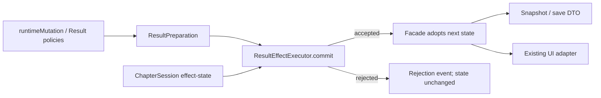

# ResultEffectExecutor 事务合同

任务：`ARCH-001 / Slice 2B`

实现 Owner：`production-code-engineer`

架构 Owner：`subsystem-domain-architect`

独立验收：`qa-bot-regression-engineer`

版本：`idlewuxia.result_effect_executor.v1`

## 1. 责任与非责任

责任：

- 接收已经展开和预检的 Result branch；
- 克隆 Runtime effect-state，按配置顺序解释效果；
- 在草稿上生成玩家、标记、实体、地图、Choice 和章节清算变化；
- 成功时返回完整下一状态和有序 side effects；
- 任一无效、未知或异常效果导致整条 branch 拒绝并丢弃草稿。

非责任：

- 不选择 NPC/物件分支；
- 不拥有 Condition 或 ResultSet preparation；
- 不写 DOM、CSS、浏览器存储或事件数组；
- 不实现真实 CombatSession、Rest/Repair 或固定时间轴替代品；
- 不拥有具体章节、NPC、物品、技能或动作 ID。

## 2. 公共接口

```js
const executor = createResultEffectExecutor(definitionsAndPolicies);

executor.commit({
  sourceId,
  currentRoomId,
  preparedBranch,
  state,
  eventIndex,
});
```

成功：

```js
{
  accepted: true,
  reason: "ok",
  state: nextEffectState,
  sideEffects: orderedSemanticEffects
}
```

拒绝：

```js
{
  accepted: false,
  reason,
  resultId,
  category,
  action,
  sideEffects: []
}
```

调用方只允许在 `accepted=true` 时采纳 `state`。输入 state 始终保持不变。

## 3. 状态所有权

`ChapterSession` 兼容 facade 仍是 Runtime Instance 的唯一状态权威。
Executor 只拥有一次 `commit` 调用期间的隔离草稿：

- `player`；
- `flags`；
- `hiddenEntityIds`；
- `addedEntityIdsByRoom`；
- `replacementEntityById`；
- `mapMarkers`；
- `pendingChoice`；
- 当前选中 NPC/物件。

事件数组、当前首局 State、任务状态和 pending combat 不进入本事务草稿。

## 4. 生命周期

1. Runtime 创建时注册不可变 Result、NPC、物件和 policy 定义。
2. 命令先经过分支选择、Condition 与 Result preparation。
3. Runtime 捕获 effect-state 并调用 `commit`。
4. Executor 克隆、解释并校验草稿。
5. 成功时 Runtime 采纳下一状态，再生成玩家可见事件。
6. 失败时 Runtime 仅追加 rejection event，游戏状态保持不变。
7. Runtime shutdown 不需要 Executor 资源清理。

## 5. 依赖图



不存在反向依赖：Executor 不依赖 Runtime facade、UI 或 persistence。

## 6. 配置合同

权威位置：

`config/wuxia_first_session_flow.json#chapterSystem.resultEffectPolicies`

`runtimeMutation` 配置负责：

- Result category 到解释器语义的映射；
- 动作名到实体、标记、故事和导航能力的映射；
- 主参数、次参数和持续时间参数位；
- 文本列表分隔符与默认值；
- 延期战斗 follow-up 的既有识别字段；
- `reject_entire_branch_and_discard_draft` 失败策略。

`config/wuxia_runtime_mutation_policy.schema.json` 定义 Draft 2020-12 结构合同；
`validate-wuxia-first-session-flow.mjs` 使用 Ajv 实际执行 Schema，并校验必需映射和失败策略。

## 7. 事件、持久化与 UI

- Executor 返回语义 side effects，但不直接追加 Runtime event。
- facade 保持既有 `npcInteraction`、`interactableInteraction`、Choice 和 Combat resolution 事件名。
- 存档 DTO 没有新增字段或版本迁移；成功草稿通过既有 `exportSaveState()` 保存。
- UI 继续读取 snapshot/event，不直接访问 Executor。
- 本切片没有修改玩家文案、布局或视觉资产。

## 8. 错误、观测与回滚

错误策略：

- 非法数值、缺少必需参数、库存不足、未知效果或执行异常全部拒绝；
- rejection 携带 reason、resultId、category 和 action；
- 不返回可被调用方采纳的部分状态；
- 不允许 `unimplemented_result_effect` 仍返回 accepted。

回滚：

- 恢复 `wuxiaFirstSessionFlow.js` 中旧 commit 闭包；
- 删除 Executor 委托与合同测试；
- 回退 `runtimeMutation` policy、validator 和生产登记；
- 存档无需迁移或降级处理，因为 DTO 未变化。

## 9. 测试合同

- 模块级：晚期无效 effect 回滚前序奖励；成功多域事务不修改输入；
- Runtime：真实 NPC branch 的晚期非法标记整条拒绝且存档状态零 mutation；房间阻挡中的后段失败产生结构化 rejection；
- Choice/Result：选择、续接、SkillConversion、ResultSet cycle；
- Persistence：恢复、事件上限、兼容性和隔离；
- 内容：358 动作风险、421 Result token、P2 closure 和数据边界；
- 浏览器：真实 9:16 交互流、控制台和人工视觉检查；
- Android：15 个产品运输文件与 2 个平台生成文件逐字节 freshness。

## 10. 已知限制

- CombatSession 与三个真实 combat result 按产品 Owner 要求继续延期；
- NavigationService、EntityInteractionService、ChapterSession 和 UI intent adapter 尚未拆分；
- JavaScript 通过运行时合同和门禁提供类型约束，不等于 TypeScript 编译期类型；
- 本合同完成不代表 ARCH-001、G4、T05-01 或商业发行完成。
