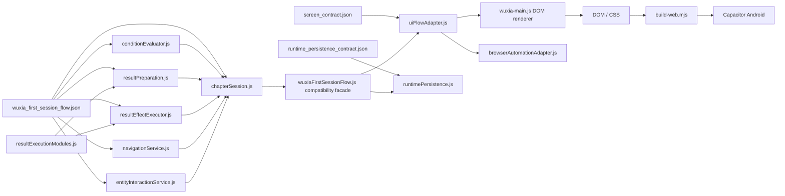
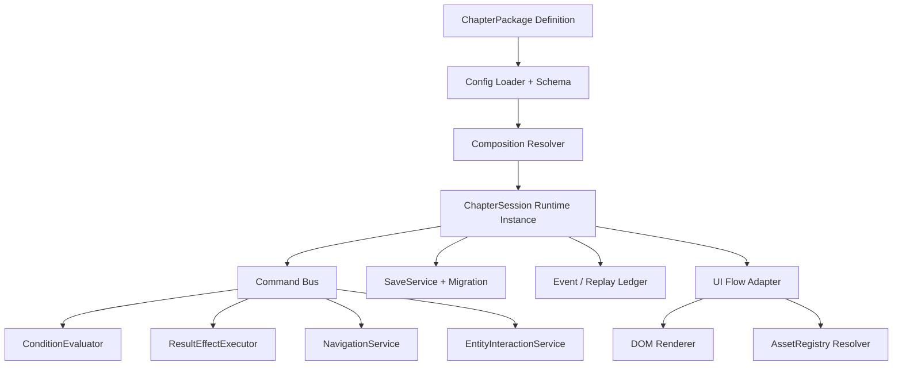

# Idlewuxia 系统架构与模块化目标

## 架构原则

- 程序负责能力、算法、解释、路由、状态、校验、渲染和规则。
- 配置负责具体章节、单位、NPC、物件、动作、条件、结果、奖励、屏幕和资产组合。
- Runtime Instance 是运行中唯一状态权威；配置对象不可被原地修改。
- 所有命令先 preflight，再原子提交；拒绝必须零 mutation。
- 事件、存档和生成物携带 Schema/配置/构建版本。
- 任何新章节不得通过 `if chapter === "fb02"` 进入程序。

## 当前链路

链路可运行；`B` 已收口为兼容入口，`P` 是唯一可写 ChapterSession 状态权威，`U` 是 DOM 与自动化共用的 ViewModel/Intent 边界，`D` 通过 `wuxiaDomAdapter.js` 统一承载 DOM、移动布局和交互绑定；延期 Combat 展示时间轴仍保留在入口编排层。

截至 2026-07-22，ARCH-001 已把 Condition 解释器提取为
`src/conditionEvaluator.js`，把 ResultSet/Choice/SkillConversion/库存预检
提取为 `src/resultPreparation.js`，把事务提交提取为 `src/resultEffectExecutor.js`，把节点、房间路线和移动阻断解释提取为 `src/navigationService.js`，并把实体可用性、选择和动作预检提取为 `src/entityInteractionService.js`。
Slice 5 已将会话状态、命令编排、事件和存档 DTO 收口到 `src/chapterSession.js`；
`wuxiaFirstSessionFlow.js` 只保留兼容 facade。Slice 6 已新增 `src/uiFlowAdapter.js` 与 `src/browserAutomationAdapter.js`，全部 DOM 交互和浏览器命令经过同一严格 Intent 通道，因此 ARCH-001 已完成；G4 仍由 T03-01、SAVE-001 与 OBS-001 阻断。

Result preparation 的库存/合成识别由
`chapterSystem.resultEffectPolicies.inventoryMutation` 提供类别、动作、参数位和
堆栈分隔符；模块只解释策略，不内置具体物品、配方、NPC 或章节 ID。
其余效果映射由 `chapterSystem.resultEffectPolicies.runtimeMutation` 与
`config/wuxia_runtime_mutation_policy.schema.json` 约束；Executor 只在隔离草稿上工作，
失败丢弃整条草稿并返回空 `sideEffects`。

## 目标模块

### 模块合同

| 模块 | 输入 | 输出 | 不得拥有 |
|---|---|---|---|
| Config Loader | JSON + Schema/version | immutable definitions | 玩家运行状态 |
| Composition Resolver | chapter/feature IDs | resolved package | DOM |
| ChapterSession | definitions + save seed | snapshot, commands, events | 具体 HTML |
| ConditionEvaluator | condition definition + snapshot | pass/fail/reason | 具体 NPC ID 分支 |
| ResultEffectExecutor | effect definition + draft transaction | typed delta | 具体章节内容 |
| NavigationService | route definition + snapshot | route decision | CSS |
| EntityInteractionService | entity/action definition | availability/command | hard-coded NPC |
| SaveService | versioned DTO | load/save/migrate/rollback | DOM |
| Event Ledger | intent/result/delta | replay/analytics record | 文案渲染 |
| UI Flow Adapter | snapshot + UI definition | view model/intent | 领域 mutation |
| AssetRegistry | logical asset ID | approved runtime URL | 未授权参考路径 |

## Definition、Rule、Composition、Instance

- Definition：NPC、物件、奖励、屏幕、资产等静态定义。
- Rule：条件、结果效果、导航、解锁和数值规则。
- Composition：章节 Feature Package 将 Definitions 和 Rules 组合。
- Runtime Instance：玩家当前状态、实体状态、库存、任务、选择和事件。

配置迁移不得把 Runtime Instance 重新写回 Definition。

## Feature Package 建议

| Package | 内容 | 当前 |
|---|---|---|
| `foundation-runtime` | condition/result/save/event/asset contracts | 部分存在，待拆分 |
| `first-session-shell` | 11 屏流程、基础反馈和持久化 | 已有纵切 |
| `chapter-fb01` | 45 房间、116 NPC、23 物件、动作和奖励 | 已配置；T03-00 为 129 可达实体、10 个受控休眠实体、0 未裁决 |
| `wuxia-ui-shell` | ViewModel、Intent、DOM adapter、导航、样式、可访问性 | UI-ARCH-001 已完成 DOM/CSS 边界；33 格视觉矩阵仍待 T05-01 |
| `wuxia-asset-presentation` | Registry、字体、地图、肖像、图标 | 仅 Registry 种子 |
| `android-release` | bundle、签名、设备、商店、回滚 | debug proof only |
| `combat-session` | 真实战斗与 Rest/Repair | 延期 |

## ARCH-001 施工切片

1. 先写 Characterization Tests，冻结 358 动作现有语义和存档 DTO。（进行中）
2. 提取纯函数 `ConditionEvaluator`，保持 token/arg 解释不变。（切片 1 已完成）
3. 提取事务型 `EffectExecutor` 与 `ResultSet` 防循环合同。（切片 2A、2B 已完成）
4. 提取 `NavigationService`。（切片 3 已完成）
5. 提取 `EntityInteractionService`。（切片 4 已完成）
6. 提取 `ChapterSession`，旧 `createFirstSessionRuntime` 保留兼容 facade。（切片 5 已完成）
7. 从 UI 控制器提取 view-model、intent mapper 和 browser automation seam。（切片 6 已完成）
8. 分离 `wuxia.css` 与 dormant legacy CSS，Web Bundle 只运输武侠样式。
9. 全部回归通过后再允许第二章节 Feature Package。

每步必须是可回滚的小提交；不得同时改内容数值与模块边界。
