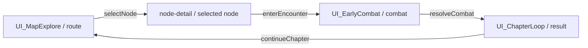

# 战斗、关卡路径与节点详情 UI 艺术方向示例（概念参考，已纠偏）

> **审计修正（2026-08-15）**：上一版把关卡路径、节点详情和战斗界面拼成一张长图，错误地把“艺术方向板”当成了可落地的运行时屏幕。该组合构图违反“一屏一个主要玩家目标”，现正式标记为 **REJECTED AS SCREEN COMPOSITION**，只保留为历史证据，不得作为 UI 实现或视觉验收样本。本记录改为三张相互独立的屏幕方向图。

## 1. 证据边界

- **证据 ID**：`UI-STYLE-001-EXAMPLE-20260814`
- **用途**：三张独立屏幕的概念方向参考，用于分别评审构图、层级、色彩、角色占位比例和信息绑定关系。
- **状态**：`concept-reference-only`（概念参考）；不是可发行 UI 贴图、不是最终角色/场景资产，也不是 T05-01 视觉验收证据。
- **生成方式**：Codex 内置图像生成工具；每张提示词均明确要求单一竖屏屏幕、像素化武侠、侧视角色/干净场景分层、无可读成品文案，并禁止把其他体验模式塞入同一画面。
- **提交边界**：三张 PNG 均位于 `outputs/`，按项目治理规则保持忽略，不提交 Git，不进入 APK/Web 产物。

| 独立方向 | 文件 | 尺寸 | SHA-256 |
|---|---|---:|---|
| 关卡路径（route） | `UI_CHAPTER_ROUTE_ART_DIRECTION_EXAMPLE_20260814.png` | 941 × 1672 | `26F5423BBD74E9D95016222F0ACC4A7EA6DC7A0E7944E475DC842A4146A3214B` |
| 节点详情（node-detail） | `UI_CHAPTER_NODE_DETAIL_ART_DIRECTION_EXAMPLE_20260814.png` | 941 × 1672 | `8F7BF1655C0FE66742D5ABB108C6C71906609F3D51EB86AC8639CFE2522AF665` |
| 战斗（combat） | `UI_COMBAT_ART_DIRECTION_EXAMPLE_20260814.png` | 941 × 1672 | `FDD487A5E2533CB3F04D78D35851627FC4DBC92D910CC7715BE53090FEA83079` |

### 1.1 旧组合板的审计结论

- `UI_COMBAT_LEVEL_ART_DIRECTION_EXAMPLE_20260814.png` 的上半战斗、下半关卡拼接不是可接受的运行时布局；它把多个目标、多个导航上下文和多个 CTA 放进同一持续视口。
- 旧图不得再用于“构图通过”“视觉验收通过”或生产实现；保留它只为解释本次纠偏的历史证据。
- 新的验收对象必须是上表三张独立图，并且最终仍需以真实运行时的 route、node-detail、combat 截图为准。

## 2. 画面中应当被借鉴的内容

这些图不是要复制某个参考项目的皮肤，而是把本项目的 UI/UX 合同转成三张可讨论的独立视觉样板。它们共享设计语言，但不共享持续视口：

### 2.1 `UI_EarlyCombat`：战斗界面样板

1. 上部保留敌我单位的轻量状态卡，HP/MP、Buff/控制状态与行动顺序靠近对应单位，不把血条单独漂浮到无主对象上。
2. 中部是干净的战斗舞台；角色是紧凑的头身组合、侧视、无正面/背面/三分之四视角，场景层与角色层分开。
3. 下部是技能/行动卡区域，主行动、目标选择、暂停/重播等动作具有明确的层级，不使用老式射击项目的横向轨道或标签栏。
4. 命中、受击、Buff 和回合反馈绑定到战斗事件，不用无法解释的装饰光效遮盖状态变化。
5. 颜色只负责强化信息，不承担唯一语义：HP/MP/Buff/锁定/禁用状态必须同时有形状、纹理、文字或位置差异。

### 2.2 `UI_MapExplore` 的 route 模式：关卡路径样板

1. 章节路由使用节点、连线和方向提示表达“当前、可达、已完成、锁定、被条件阻断”。
2. 节点详情区集中表达进入条件、预计风险、奖励来源和唯一下一步动作；不能只显示一个“开始”按钮而没有上下文。
3. 场景/地图作为独立背景层；角色、NPC、交互热点和奖励图标由运行时挂载，不烘焙进场景图。
4. 底部导航是手游竖屏中的稳定操作区，触控尺寸和安全区遵循 `ui_neutral_visual_contract.json`。

### 2.3 节点详情模式：独立详情样板

1. 节点详情只表达选中节点的目标、进入条件、风险、奖励来源和唯一 CTA。
2. 详情页不得持续显示完整路线图、战斗单位卡、技能卡、回合条或战斗反馈堆栈。
3. 当前运行时在未新增屏幕 ID 前，可以把它实现为 `UI_MapExplore` 的瞬态 `node-detail` 状态；如果内容超过紧凑详情单，则必须先增加独立屏幕合同。

## 3. 最终武侠像素方向

这是本项目的目标语言，不等同于 HD-2D，也不等同于旧参考项目：

- 画布：墨青、漆黑、暖米纸三层关系；背景留出暗部，确保战斗角色与状态卡的可读性。
- 强调色：青玉蓝表示主行动/可用，朱砂表示危险/失败/受击，旧金表示奖励/稀有度，墨线表示边界与分隔。
- 线条：像素化硬边与有限级数明暗，禁止高斯模糊、照片化景深、塑料渐变和过度发光。
- 角色：只制作侧视资产；以 `body`、`head-base`、`eyes`、`mouth`、`hair` 五个逻辑部件组合，避免独立七头身腿部剪影。
- 场景：只输出干净场景图，不带角色、不带 UI、不带文字；角色、NPC、VFX、音效单独挂载。
- 动画：至少区分 `idle`、`move`、`attack`、`hurt`、`control`、`defeat`；移动必须有左右脚/身体重心交替，不能用同一帧平移冒充走路。
- UI 材质：可以使用克制的纸张颗粒、木/漆边框和印章形几何，但纹理不能降低正文、数值或按钮的对比度。

## 4. 手动视觉评审记录

### 4.1 通过项（作为三张独立概念方向）

- **构图**：route、node-detail、combat 各自只有一个主要玩家目标，符合竖屏快速读屏和单手操作的优先级。
- **色彩**：墨青/漆黑/米纸为底，青玉、朱砂、旧金作为状态强调，符合项目目标色彩合同。
- **角色比例**：图中角色呈紧凑头身组合，未使用单独长腿剪影；仅作为方向参考，不能替代最终像素角色帧。
- **分层**：战斗舞台、角色、状态卡、技能区、路线图和详情卡分别属于其各自屏幕的运行时层。
- **状态表达**：战斗单位状态、路线节点状态和详情状态均有卡片/标记/位置差异，不依赖单一颜色。
- **信息层级**：每张图只有一个明显主入口，符合 `primary-action` 约束。

### 4.2 明确不通过项（作为生产资产）

- 图像中出现的伪文字/不可读字形不能直接作为玩家文案，必须由运行时本地化文本绘制。
- 角色、场景、技能图标、Buff 图标和特效没有资产所有权、来源、授权、hash 和导入记录，不能进入 shipping。
- 该图没有证明 360×800、390×844、412×915 三尺寸的安全区、触控和文字溢出。
- 该图没有证明真实运行时绑定、战斗事件回放、暂停/恢复、音效延迟或设备性能。
- 该图没有证明最终像素网格、帧率、pivot、透明区和逐帧动画质量。

## 4.3 屏幕边界与体验流

- `route` 只负责当前位置、可达路线、节点状态和选择；不持久显示战斗单位卡、技能卡或战斗反馈。
- `node-detail` 只负责选中节点的目标、条件、风险、奖励和唯一进入动作；不持久显示完整路线图或战斗面板。
- `combat` 只负责战斗舞台、单位状态、回合、技能/目标、反馈和暂停/重播；不持久显示章节路线或节点奖励详情。
- 当前若不新增屏幕 ID，`node-detail` 只能是 `UI_MapExplore` 内的瞬态模式；这不是把三者拼在一起的许可。

**最终人工判定：旧组合板 `REJECTED AS SCREEN COMPOSITION`；三张独立图 `PASS AS SEPARATE CONCEPT DIRECTIONS / BLOCKED AS PRODUCTION ASSETS`。**

## 5. 从概念板进入生产的拆解

概念板不能直接进入运行时。生产必须按下列顺序把它转换成配置和受控资产：

1. 先以 [UI/UX 边界与中性 UI 标准](UI_UX_BOUNDARY_AND_NEUTRAL_UI_STANDARD_20260814.md) 生成无内容中性图，证明区域、组件、状态和交互目标。
2. 再按 `UI_MapExplore(route) -> node-detail -> UI_EarlyCombat(combat) -> UI_ChapterLoop(result) -> UI_MapExplore(route)` 的顺序实现；所有按钮对应 `wuxia_ui_intent_contract.schema.json` 中的 intent。
3. 角色、场景、VFX、音频先使用原项目已有的参考绑定推进功能；缺少可用资产的槽位写入资产需求表，不用 CSS 几何图形冒充生产资产。
4. 资产达到授权、hash、像素规格、侧视、比例、帧率、pivot、透明区和运行时挂载要求后，才生成最终风格版本。
5. 最后重跑 11 屏 × 3 尺寸矩阵，逐屏、逐状态、逐动画、逐音效手动验收；自动化通过不能替代人工视觉验收。

## 6. 关联契约与后续门禁

- 中性 UI 合同：[ui_neutral_visual_contract.json](../../config/production/ui_neutral_visual_contract.json)
- 中性 UI Schema：[ui_neutral_visual_contract.schema.json](../../config/production/schemas/ui_neutral_visual_contract.schema.json)
- 中性 UI 验证器：[validate-ui-neutral-contract.mjs](../../tools/validate-ui-neutral-contract.mjs)
- 中性 UI 测试：[test-ui-neutral-contract.mjs](../../tools/test-ui-neutral-contract.mjs)
- 战斗表现合同：[wuxia_combat_presentation_contract.json](../../config/wuxia_combat_presentation_contract.json)
- 生产视觉标准：[visual_standard.json](../../config/production/visual_standard.json)

当前只关闭了 UI 风格定义和概念参考这一项；`COMBAT-002B`、`T05-01`、正式角色/场景/VFX/音频资产、真机与 Release 门禁仍保持原状态，不能因为概念图好看而提前宣称完成。
